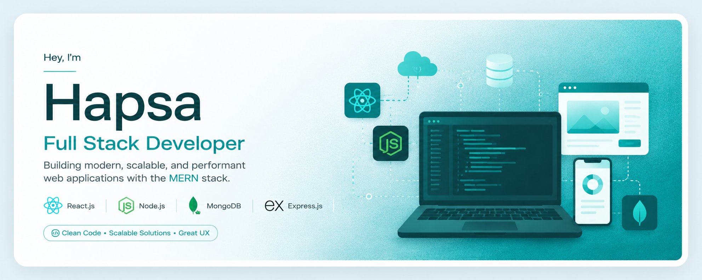

  

<h1 align="center"> Hapsa Khatun</h1>
<h3 align="center"> Full Stack Developer</h3>

---

## 🚀 About Me

I'm a passionate Junior Full Stack (MERN) Developer from Bangladesh who enjoys building modern, responsive, and user-friendly web applications. I love solving real-world problems through code and continuously improving my development skills. Currently, I'm focusing on Next.js and creating scalable full-stack projects for my portfolio.

---

## 🌱 Current Activities

- 🌐 Exploring **Next.js**
- 🏝️ Working on a **Tourism Website**
- 💻 Building full-stack MERN applications
- 📚 Learning advanced React patterns and backend development

---

## 🛠️ Skills

### 🎨 Frontend

  

### ⚙️ Backend

  

### 🗄️ Database

  

### 🧰 Tools

  

---

## 🌐 Connect with Me

  

  

  

---

## 🚀 Featured Projects

### 🚀 StartupForge

A startup team builder platform where founders can publish startup ideas, recruit collaborators, and manage opportunities.

**Tech Stack:** Next.js • Node.js • Express.js • MongoDB • Better Auth • Tailwind CSS

🔗 **Live Demo:** https://startup-forge-wbdi.vercel.app

💻 **Client Repository:** https://github.com/hapsakhatun-10/StartupForge-

---

### 🐾 PetHome

A full-stack pet adoption platform with secure authentication, adoption requests, and donation campaigns.

**Tech Stack:** React • Node.js • Express.js • MongoDB • JWT • Tailwind CSS

🔗 **Live Demo:** https://assignment-09-a6sk.vercel.app/

💻 **Client Repository:** https://github.com/hapsakhatun-10/Assignment-09

---

## 📫 Contact Me

- 📧 Email: **hk.hapsakhatun@gmail.com**
- 🌍 Portfolio: **https://portfolio-liart-theta-oku4d0hqfk.vercel.app**
- 💼 LinkedIn: **https://www.linkedin.com/in/hapsakhatun710**
- 💻 GitHub: **https://github.com/hapsakhatun-10**

---

# 📊 GitHub Stats

  
  

  

---

<h3 align="center">
✨ Thanks for visiting my profile! Happy Coding 🚀
</h3>
